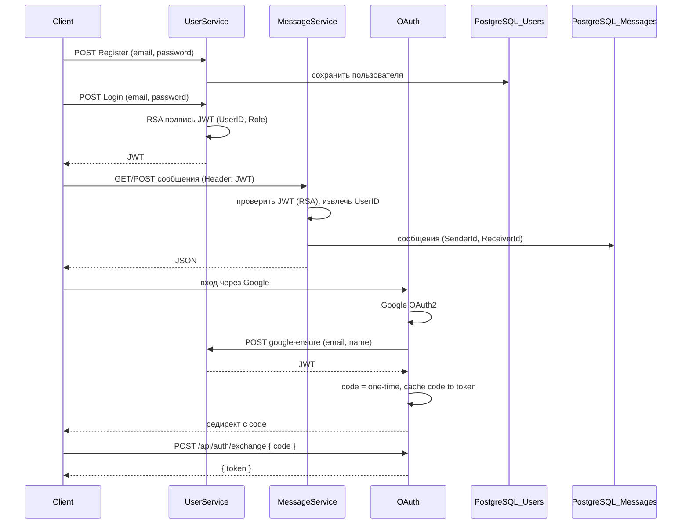

# PRD: Веб-API обмена сообщениями (дипломный проект)

Документ описывает продукт, архитектуру и требования на основе плана исправления и принятых решений.

---

## 1. Принятые решения

| Вопрос | Решение |
|--------|--------|
| БД | Только **PostgreSQL** (контейнер уже запущен). Строка подключения — из конфига (`ConnectionStrings:DefaultConnection`). |
| Аутентификация | **Email + пароль** (вход и регистрация по email, не по имени). |
| OAuth | **Включить в README**: описать как отдельный способ входа (Google) в рамках проекта. |
| Структура папок | Проекты в **src/** (UserService, MessageService, OAuth), тесты в **tests/UnitTest/**. |
| UserService, DI | **Использовать Autofac**: раскомментировать/реализовать `ConfigureContainer`, регистрировать сервисы и контекст БД через Autofac. |
| Отметка о прочтении | **Оставить как есть**: при получении списка сообщений они помечаются прочитанными; отдельного endpoint «mark as read» не делать. |
| Архитектура | Зафиксировать явно (см. раздел 3). |

---

## 2. Цели и принципы

1. **Единый источник правды**: README = описание стека и функционала; код и тесты соответствуют README.
2. **Одна схема JWT**: подпись и проверка токена — **RSA** (ключи из `rsa/public_key.pem`, `rsa/private_key.pem`).
3. **Одна БД на сервис**: PostgreSQL, строка подключения только из конфига, без захардкоженных строк в коде.
4. **Пароли**: хранение в виде **SHA512 + salt** (не RSA); RSA только для подписи JWT.
5. **Тесты**: только под реальные API и модели; удалить тесты под несуществующие эндпоинты.

---

## 3. Архитектура

Четыре приложения в одном решении (solution):

```
Solution
├── ApiGateway     — единая точка входа (Ocelot), маршрутизация на UserService и MessageService, Swagger для обоих
├── UserService    — регистрация, вход (email + пароль), выдача JWT (RSA)
├── MessageService — отправка/получение сообщений, фильтр по получателю, прочтение при GetMessages
└── OAuth          — вход через Google (отдельное веб-приложение с UI)
```

- **Доступ к сервисам** организуется через **API Gateway** (Ocelot): клиенты обращаются к Gateway (порт 6000), который проксирует запросы к UserService (5103) и MessageService (5003). Swagger на Gateway объединяет документацию обоих сервисов (Swagger for Ocelot).
- **UserService** и **MessageService** — REST API (JSON), Swagger на своих портах; при работе через Gateway запросы идут через него.
- **OAuth** — MVC-приложение с страницами и редиректами Google; доступ к OAuth — **прямой** (не через Gateway); после входа через Google выдаёт JWT через **exchange-flow** (см. ниже).
- Пользователи (email, пароль, роли) хранятся только в **UserService** (одна БД). JWT содержит **числовой UserID** и Role.
- **MessageService** не хранит пользователей: проверяет JWT и использует UserID из токена. Сообщения хранятся с полями **SenderId**, **ReceiverId** (int).

Диаграмма потоков:



### 3.1. Безопасность: JWT и ключи

- **private_key.pem** — хранится **только в UserService**. Используется исключительно для подписи JWT (логин, google-ensure). Ни в MessageService, ни в OAuth, ни в других сервисах не размещать и не передавать.
- **public_key.pem** — используется для проверки подписи JWT. Должен быть доступен:
  - **UserService** — при необходимости проверки входящих Bearer-запросов к своим API;
  - **MessageService**, **OAuth** и любым другим сервисам, которые принимают JWT и проверяют подпись.

При развёртывании: в конфиге каждого сервиса указывать путь к своему ключу (или копию публичного ключа в папке сервиса). Единая точка выдачи токенов — UserService; остальные только верифицируют.

---

## 4. Структура папок

- Корень: `.sln`, `README.md`, `docs/`
- `src/ApiGateway/`, `src/UserService/`, `src/MessageService/`, `src/OAuth/`
- `tests/UnitTest/`
- `docs/` — документация и планы

---

## 5. Функциональные требования (кратко)

### 5.1 UserService

- Регистрация: email (уникальный), пароль; роль по умолчанию User; один Admin (правило сохранить).
- Вход: email + пароль → JWT (RSA), claims: **UserID** (числовой), Role.
- Пароли: хранение SHA512 + salt.
- БД: PostgreSQL, строка из конфига.
- DI: Autofac (регистрация репозиториев, контекста БД и т.д.).

### 5.2 MessageService

- Отправка сообщения: тело `{ text, receiverId }`; отправитель (senderId) из JWT (UserID).
- Получение сообщений: получатель (receiverId) из JWT; при выдаче списка — помечать прочитанными.
- БД: PostgreSQL, строка из конфига (`ConnectionStrings:DefaultConnection`).
- Аутентификация: проверка JWT (RSA, тот же публичный ключ, что в UserService).

### 5.3 OAuth

- Вход через Google; после успешного входа OAuth вызывает UserService `POST /api/users/google-ensure` (email, name), получает JWT.
- **Exchange-flow**: OAuth сохраняет пару «одноразовый code → token» в кэше (TTL 1–2 мин), редиректит клиента на URL с `?code=...`. Клиент вызывает `POST /api/auth/exchange` с телом `{ "code": "..." }` и получает в ответе `{ "token": "..." }`; код одноразовый.
- В README: отдельный подраздел с описанием назначения, exchange-flow и запуска.

### 5.4 Документация (README)

- Стек: .NET 8, PostgreSQL, JWT (RSA), Autofac, AutoMapper (MessageService), xUnit, Swagger.
- Аутентификация: email + пароль; OAuth (Google) — отдельно.
- Пароли: хэширование SHA512 + salt; RSA только для JWT.
- Установка: клонирование, настройка PostgreSQL (в т.ч. контейнер), конфиг, запуск UserService, MessageService, ApiGateway, при необходимости OAuth.
- Примеры тестов: реальные эндпоинты и модели (MessageManager, Login и т.д.).

---
